# StrumSure: Smart Guitar Tuner & Chord Detector

## Table of Contents
- [Introduction](#introduction)
- [Features](#features)
- [Technical Architecture & Key Components](#technical-architecture--key-components)
- [Getting Started](#getting-started)
- [Future Enhancements](#future-enhancements)
- [Screenshots & Demo](#screenshots--demo)
- [Contributing](#contributing)
- [License](#license)
- [Contact](#contact)

---

## Introduction

StrumSure is an innovative guitar tuning and chord detection application designed to assist musicians with both real-time instrument tuning and post-analysis of recorded audio. It offers a blend of traditional software-based tuning, smart tuner integration via Bluetooth Low Energy (BLE), and advanced AI-powered chord detection for audio files.

The application aims to provide a comprehensive toolkit for guitarists, from beginners needing precise tuning feedback to experienced players wanting to analyze chord progressions in their recordings.

---

## Features

StrumSure offers a robust set of features to enhance your musical journey:

### Real-time Guitar Tuning

- **Precision Tuning**: Utilizes a Circular Tuner to provide immediate, visual feedback on pitch deviation in cents, helping you achieve perfect tune.
- **Frequency Graph**: Displays a real-time, scrolling graph of frequency deviation, offering a historical view of your tuning accuracy and stability.
- **Automatic & Manual Modes**:
    - **Automatic Tuning**: Automatically detects the string you're playing and guides you to the correct pitch.
    - **Manual String Selection**: Allows you to manually select a target string (e.g., E4, A2) for focused tuning.
- **Target Note Display**: Clearly shows the target note and its exact frequency (e.g., "E4 (329.6 Hz)").
- **Detected Note Display**: Provides real-time feedback on the detected note and its frequency (e.g., "A4 440.2 Hz").

### Smart Tuner Integration (BLE)

- **ESP32 Connectivity**: Connects to an external ESP32-based smart tuner via Bluetooth Low Energy (BLE).
- **Device Discovery & Connection**: Scans for available BLE devices, displays connection status, and allows seamless connection/disconnection.
- **Real-time Commands**: Receives simulated "motor control" commands (e.g., "Tighten E4 by 5 degrees") from the ESP32, providing actionable tuning instructions.
- **Platform Compatibility**: Handles BLE functionality gracefully across various platforms, with specific considerations for Android, iOS, Windows, and Web.

### AI-Powered Chord Detection

- **Audio File Analysis**: Upload audio files (.wav, .mp3, .m4a) for sophisticated chord detection using a Google Colab backend.
- **Detailed Chord Results**: Displays detected chords with their start and end times, along with the individual notes identified within each chord.
- **Local Storage**: Save analyzed songs (audio file + chord data) directly to your device for later review and playback.

### Saved Song Management & Playback

- **Song Library**: A dedicated screen to browse and manage all your previously analyzed and saved songs.
- **Interactive Playback**: Play back saved audio recordings with real-time synchronized chord visualization, highlighting the active chord as the song progresses.
- **Seek Functionality**: Easily navigate through the song using a progress slider.
- **Song Management**: Rename, delete, and share your saved recordings.

### User Experience & Theming

- **Intuitive UI**: Clean, responsive, and easy-to-navigate interface.
- **Theming Options**: Seamlessly switch between Light Mode, Dark Mode, or follow your System's theme preference for a personalized visual experience.
- **Robust Error Handling**: Provides clear status messages, loading indicators, and informative SnackBars for various operations (e.g., microphone permission, network errors).
- **App Lifecycle Management**: Automatically stops tuning and releases microphone resources when the app is backgrounded to conserve battery.

---

## Technical Architecture & Key Components

StrumSure is built with Flutter and Dart, following a modular architecture to ensure maintainability, scalability, and a clear separation of concerns. It integrates with external hardware (ESP32) and a cloud-based AI backend (Google Colab) for its core functionalities.

### Flutter Application (`lib/`)

The Flutter application serves as the primary user interface and orchestrates interactions with the device's hardware and external services.

#### `lib/main.dart` (Application Entry Point & Theming)

**Purpose**: The foundational entry point and configuration hub for the entire StrumSure application. It sets up the Flutter environment, defines global state management via MultiProvider, establishes the application's visual themes, and manages the top-level navigation.

**Key Functionality**:
- Initializes WidgetsFlutterBinding and sets preferred device orientations (portrait only).
- Registers BleService, TunerDataNotifier, and ThemeNotifier using MultiProvider for global state access.
- Defines comprehensive Material 3 `_lightTheme` and `_darkTheme` objects with a custom color palette (e.g., `_calmTeal`, `_lightBackgroundColor`).
- Manages dynamic theme switching based on user preference or system settings.
- Establishes the MainAppWrapper as the root navigation shell, providing a Drawer for switching between main screens.

#### `lib/state/tuner_data_notifier.dart` (Central Tuning State Management)

**Purpose**: A ChangeNotifier that acts as the central state manager for all real-time guitar tuning data and logic. It processes raw audio input, calculates pitch, and manages the tuning state.

**Key Functionality**:
- Manages microphone permission and audio input.
- Calculates real-time frequency deviation in cents and stores historical data.
- Determines the detected note name and frequency.
- Manages the target note for tuning (manual or auto-detected).
- Integrates with BleService to send tuning data to the ESP32.
- Provides methods to `startTuning()`, `stopTuning()`, and `toggleAutoTuningMode()`.

#### `lib/services/ble_service.dart` (Bluetooth Low Energy Connectivity)

**Purpose**: A ChangeNotifier responsible for all Bluetooth Low Energy (BLE) interactions, enabling the Flutter app to discover, connect to, and communicate with the ESP32 smart tuner.

**Key Functionality**:
- Handles BLE permission requests (Bluetooth, Location).
- Manages BLE scanning (`startScan()`, `stopScan()`) and lists `availableDevices`.
- Facilitates connecting to (`connectDevice()`) and disconnecting from (`disconnectDevice()`) BLE devices.
- Manages the `connectionStatusMessage` and `isConnected` state.
- Sends tuning data to the ESP32 via BLE write operations.
- Receives and stores `receivedBleData` (tuning commands) from the ESP32 via BLE notifications.

#### `lib/services/local_storage_service.dart` (Local Data Persistence)

**Purpose**: Provides an abstraction layer for saving and retrieving structured data (analyzed songs and their chord data) to the device's local persistent storage.

**Key Functionality**:
- Handles saving SavedSong objects, including the audio file and its associated ChordData.
- Retrieves a list of all SavedSong objects.
- Deletes specific SavedSong objects and their corresponding audio files.
- Manages file paths for audio recordings.

#### `lib/widgets/circular_tuner.dart` (Visual Tuner Gauge)

**Purpose**: A CustomPainter widget that visually represents the cents deviation from the target note using a circular gauge.

**Key Functionality**:
- Renders a dynamic, color-coded arc indicating whether the note is flat, sharp, or in tune.
- Displays the current cents deviation numerically.
- Provides visual cues for the target note and the detected note.
- Optimized for performance with shouldRepaint to prevent unnecessary redraws.

#### `lib/widgets/frequency_graph.dart` (Historical Frequency Graph)

**Purpose**: A CustomPainter widget that displays a real-time, scrolling graph of frequency deviation in cents, offering a historical and dynamic view of tuning accuracy.

**Key Functionality**:
- Draws a scrolling line graph of FrequencyPoint data.
- Includes grid lines and a prominent center line for 0 cents (perfect tune).
- Draws color-coded circles for individual data points, reflecting tuning accuracy.
- Displays "Start tuning to see graph" or "Listening..." messages based on tuner state.
- Optimized for performance with shouldRepaint.

#### `lib/widgets/guitar_string_selector.dart` (Guitar String Selection)

**Purpose**: A StatelessWidget that provides an intuitive and interactive way for users to select a specific guitar string (represented by its musical note) as their current tuning target in manual mode.

**Key Functionality**:
- Renders a row of tappable buttons for standard guitar strings (E2, A2, D3, G3, B3, E4).
- Visually highlights the selectedNote.
- Invokes an onNoteSelected callback when a new string is chosen.
- Integrates with the app's theming for consistent styling.

#### `lib/screens/tuner_screen.dart` (Main Tuning Interface)

**Purpose**: The primary user interface for the guitar tuning functionality. It integrates various smaller widgets and interacts with TunerDataNotifier to display real-time feedback.

**Key Functionality**:
- Manages `_isStartingTuning` and `_isStoppingTuning` loading states.
- Handles app lifecycle changes (`didChangeAppLifecycleState`) to stop tuning when the app goes to the background.
- Provides "Start Tuning" and "Stop Tuning" buttons with loading indicators and error handling (SnackBars).
- Integrates Automatic Tuning Toggle, GuitarStringSelector, Target Note Display, Detected Note and Frequency Display, CircularTuner, and FrequencyGraph.
- Disables the GuitarStringSelector when auto-tuning is active.

#### `lib/screens/chord_detector_screen.dart` (Audio Chord Detection Interface)

**Purpose**: A dedicated screen for analyzing audio files to detect chords. It provides the full workflow for users to select an audio file, send it to an external backend, view detected chords, and save results.

**Key Functionality**:
- Manages state for file selection (`_selectedFileName`, `_selectedAudioFile`), analysis progress (`_isLoading`), chord results (`_chordResults`), and saving (`_isSaving`).
- Handles requesting necessary storage permissions.
- Provides "Pick Audio File," "Analyze Audio," and "Save Song" buttons.
- Orchestrates the HTTP request to the Google Colab backend for audio analysis.
- Parses and displays chord analysis results in a scrollable list.
- Integrates with LocalStorageService for saving songs.

#### `lib/screens/saved_songs_list_screen.dart` (Saved Songs Library)

**Purpose**: Serves as a library for all songs previously analyzed for chords and saved by the user. It provides an interface to browse, interact with, and manage these recordings.

**Key Functionality**:
- Loads and displays a list of SavedSong objects from LocalStorageService.
- Provides a "pull-to-refresh" mechanism to update the list.
- Allows users to delete songs with a confirmation dialog.
- Navigates to the SongPlaybackScreen when a song is tapped.
- Displays status messages for loading, empty state, and errors.

#### `lib/screens/song_playback_screen.dart` (Synchronized Song Playback)

**Purpose**: Designed for playing back a previously saved audio recording and visually synchronizing its playback with the chords that were detected during analysis.

**Key Functionality**:
- Manages just_audio's AudioPlayer instance, playback state, duration, and position.
- Determines and highlights the `_currentChord` based on playback position, with a configurable `_chordLookAheadMs` for smoother visual transitions.
- Programmatically scrolls the chord list to bring the active chord into view.
- Provides standard audio controls: play, pause, and seek.
- Displays the song title, current chord prominently, and a list of all detected chords.
- Handles platform compatibility for audio playback (e.g., displaying warnings on Web/Windows).

#### `lib/screens/ble_tuner_connect_screen.dart` (BLE Connection Manager)

**Purpose**: A dedicated user interface for managing Bluetooth Low Energy (BLE) connections with an external ESP32-based smart tuner.

**Key Functionality**:
- Displays "Scan Devices" and "Disconnect" buttons.
- Shows connection status, connected device details, and received BLE data.
- Provides reminder cards for common BLE issues (Bluetooth off, Location Services off) with options to open device settings.
- Lists availableDevices found during scanning, allowing users to connect.
- Adapts UI elements and functionality based on platform (native mobile vs. web/desktop).

#### `test/widget_test.dart` (Basic Widget Tests)

**Purpose**: Contains a suite of basic Flutter widget tests to verify core UI interactions and state changes within the TunerScreen.

**Key Functionality**:
- Uses flutter_test utilities (`tester.pumpWidget`, `tester.tap`, `find.text`, `expect`) to simulate user input and assert on UI states.
- Verifies initial screen messages, button functionality (Start/Stop Tuning), and string selection changes.
- Ensures basic user flows on the TunerScreen behave as expected.

### ESP32 BLE Tuner Firmware (Arduino Sketch)

This Arduino sketch (`esp32_firmware/strum_sure_esp32_tuner_firmware/strum_sure_esp32_tuner_firmware.ino`), designed for an ESP32-WROOM-32 module, transforms the ESP32 into a Bluetooth Low Energy (BLE) peripheral device that functions as a "smart tuner."

**Key Functionality**:
- **BLE Server Setup**: Initializes the ESP32 as a BLE server with custom service and characteristic UUIDs for transmit (TX) and receive (RX) channels.
- **Connection Management**: Detects client connections and disconnections, automatically restarting BLE advertising upon disconnection for easy re-discovery.
- **Data Reception**: Receives real-time tuning data (detected frequency, target frequency, target note) from the Flutter app via the RX characteristic.
- **Tuning Command Generation**: Calculates cents deviation and generates human-readable "motor control" commands (e.g., "Tighten E4 by 5 degrees") based on tuning accuracy.
- **BLE Notifications**: Sends these tuning commands back to the connected Flutter app via TX characteristic notifications.
- **Configurable Parameters**: Allows tuning of parameters like `CENTS_TO_DEGREE_RATIO`, `MAX_MOTOR_DEGREES`, and `MIN_CENTS_THRESHOLD`.

### Google Colab Backend (Python Notebook)

This Google Colab notebook (`colab_backend/strum_sure_chord_detector_backend.ipynb`) serves as the backend for the StrumSure mobile application's chord detection feature. It sets up a Python environment, configures a Flask web server, implements audio processing logic using the madmom library, and exposes this server to the internet via pyngrok.

**Key Functionality**:
- **Environment Setup**: Installs necessary system packages (ffmpeg, libsndfile1) and Python libraries (madmom, pydub, Flask, pyngrok, numpy, librosa, soundfile).
- **Audio Conversion**: Includes a `convert_to_wav()` function using pydub to convert various input audio formats (MP3, M4A) to WAV for optimal madmom processing.
- **Chord Detection Logic**: The `detect_chords_and_notes()` function orchestrates:
    - **Chord Feature Extraction**: Using `madmom.features.chords.CNNChordFeatureProcessor`.
    - **Chord Recognition**: Using `madmom.features.chords.CRFChordRecognitionProcessor` to identify chord labels and their time segments.
    - **Note Detection**: Extracts DeepChromaProcessor features and identifies individual notes within each chord segment.
- **Flask API Endpoint**: Exposes a `/analyze_audio` POST endpoint that:
    - Receives uploaded audio files from the Flutter app.
    - Processes the audio using the chord detection logic.
    - Returns structured JSON results containing chord names, start/end times, and detected notes.
    - Implements robust error handling for file issues, processing failures, and network errors.
- **Public Exposure**: Uses pyngrok to create a secure public tunnel to the Flask server, providing a temporary URL that the Flutter app can use to send requests.

---

## Getting Started

To get a copy of StrumSure up and running on your local machine, follow these steps:

### Prerequisites

- **Flutter SDK**: Ensure you have Flutter installed. You can follow the [official Flutter installation guide](https://flutter.dev/docs/get-started/install).
- **Android Studio / VS Code**: With Flutter and Dart plugins installed.
- **ESP32 Development Environment**: If you plan to use the smart tuner functionality, you'll need the Arduino IDE with ESP32 board support installed to flash the firmware to your ESP32.
- **Google Colab Account**: To run the chord detection backend, you'll need a Google account to access Google Colab.

### Installation (Flutter App)

1. Clone the repository:
   ```bash
   git clone https://github.com/ajayi-ei/StrumSure.git
   cd StrumSure
   ```

2. Install Flutter dependencies:
   ```bash
   flutter pub get
   ```

### Running the Application (Flutter App)

1. Connect a device or start an emulator:
   ```bash
   flutter devices
   ```

2. Run the app:
   ```bash
   flutter run
   ```

The application should launch on your connected device or emulator.

### Setting up the ESP32 Smart Tuner

1. **Open the ESP32 Firmware**: Load the `strum_sure_esp32_tuner_firmware.ino` sketch from `esp32_firmware/strum_sure_esp32_tuner_firmware/` into your Arduino IDE.
2. **Install ESP32 Board Support**: If not already installed, add ESP32 board support to your Arduino IDE.
3. **Install Libraries**: Ensure you have the NimBLE-Arduino library installed.
4. **Configure & Upload**: Select your ESP32 board and port, then upload the firmware to your ESP32-WROOM-32 module.

### Setting up the Google Colab Backend

1. **Open the Colab Notebook**: Open the `strum_sure_chord_detector_backend.ipynb` notebook from `colab_backend/` in Google Colab.
2. **Run All Cells**: Execute all cells in the notebook. This will install dependencies, start the Flask server, and create an ngrok tunnel.
3. **Copy ngrok URL**: Once the ngrok tunnel is established, a public URL will be displayed in the Colab output (e.g., `https://xxxxxx.ngrok-free.app`). You must copy this URL.
4. **Update Flutter App**: In the Flutter app's `lib/screens/chord_detector_screen.dart` file, locate the `_colabApiUrl` constant and update its value with the ngrok URL you copied.

   ```dart
   // In lib/screens/chord_detector_screen.dart
   final String _colabApiUrl = 'YOUR_NGROK_URL_HERE/analyze_audio'; // <-- Update this line
   ```

5. **Restart Flutter App**: Restart your Flutter application after updating the URL for the changes to take effect.

---

## Future Enhancements

We have several exciting improvements planned for StrumSure, including:

- **Enhanced Tuning Algorithms**: Further refinement of pitch detection accuracy and stability.
- **Expanded Instrument Support**: Adding support for other stringed instruments (e.g., bass, ukulele).
- **Advanced Chord Analysis**: More detailed chord variations, inversions, and rhythmic analysis.
- **UI/UX Improvements**: Continuous enhancement of the user interface for even greater intuitiveness and visual appeal.
- **Cross-Platform Expansion**: Full native support for iOS, Windows, Linux, and Web platforms.

---

## Screenshots & Demo

### Guitar Tuner Interface

#### Main Tuning Screen
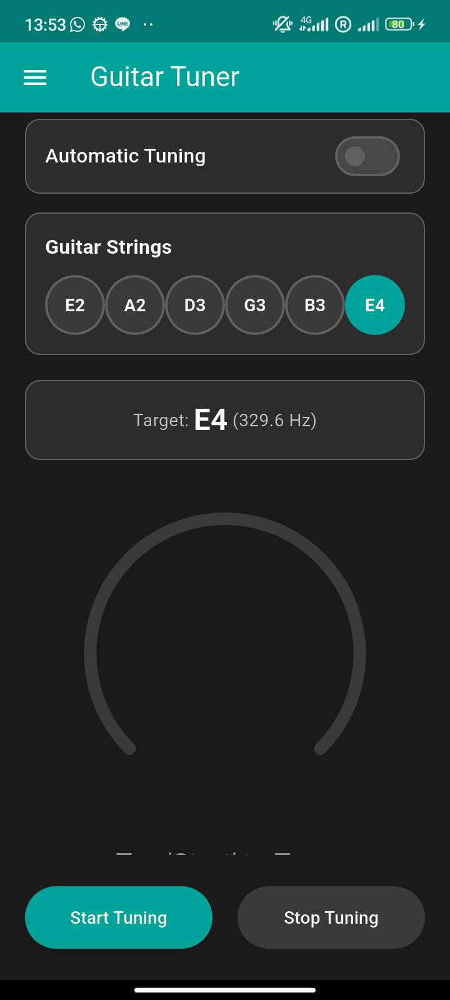

#### Auto Tuning Mode
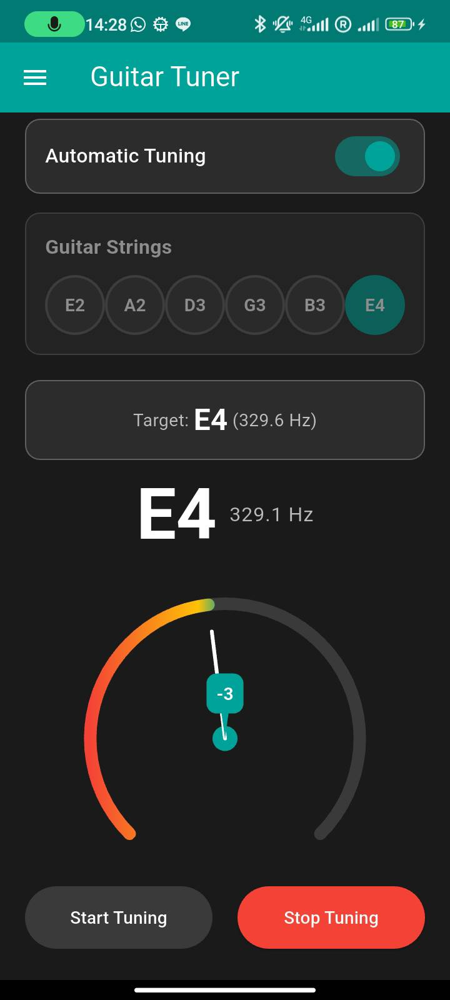

#### Manual Tuning Mode
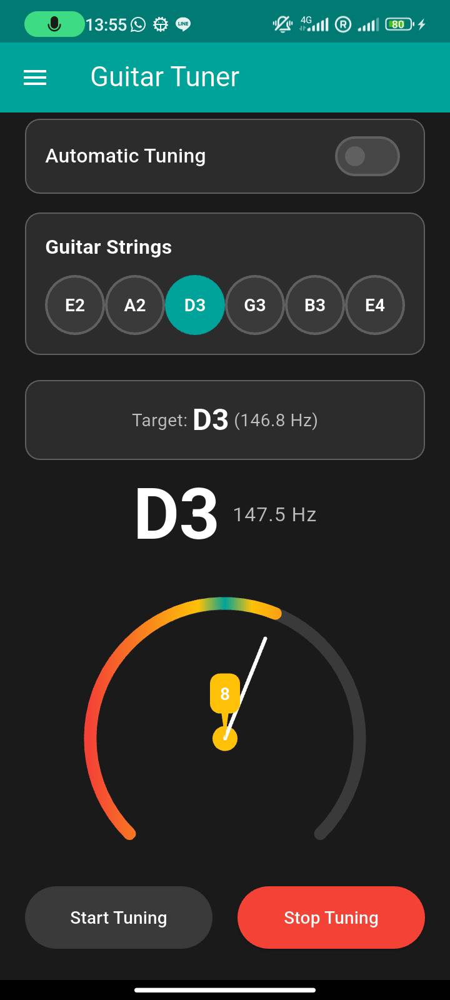

#### Circular Tuner Display
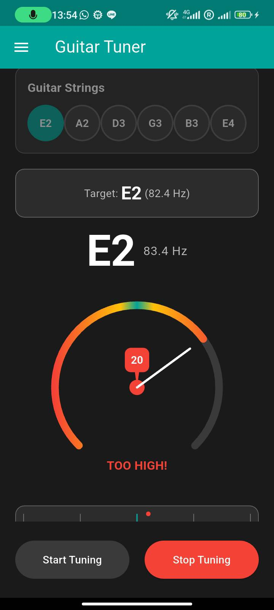

#### Frequency Graph
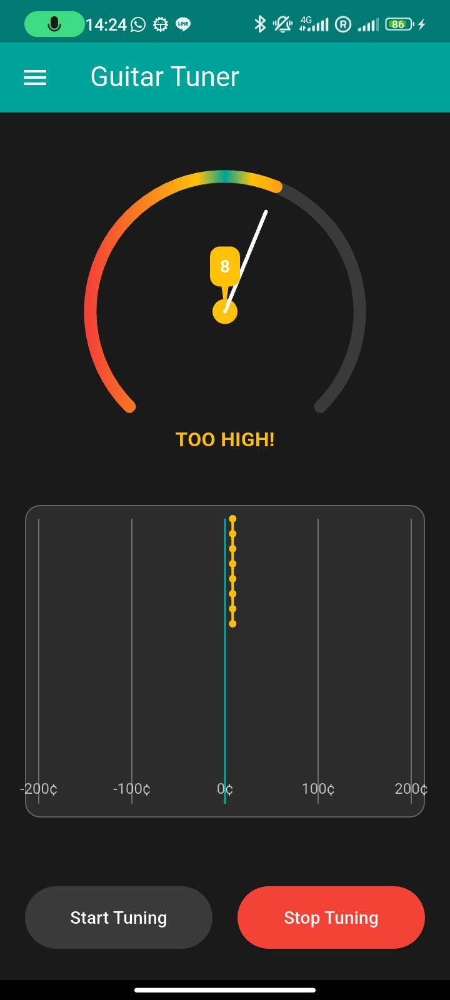

#### Guitar Perfectly Tuned
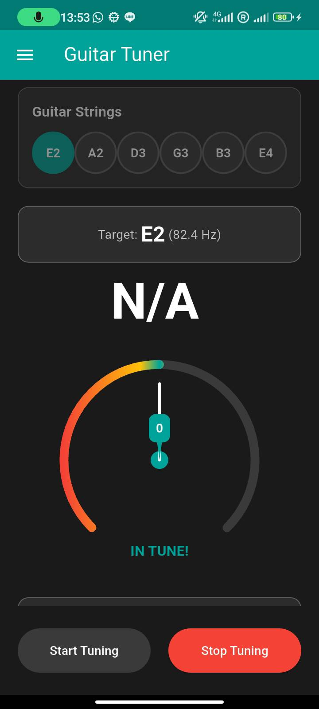

### BLE Smart Tuner Connection

#### BLE Connection Screen
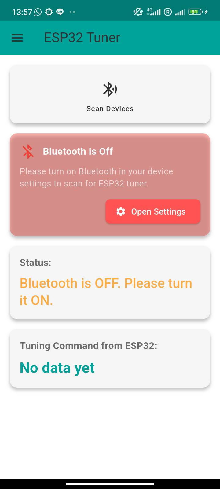

#### Bluetooth Settings
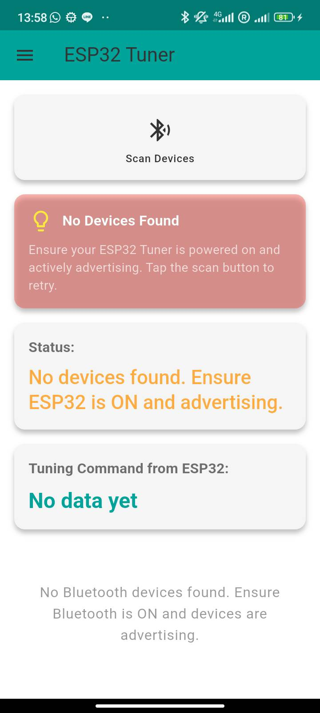

#### ESP32 Device Found
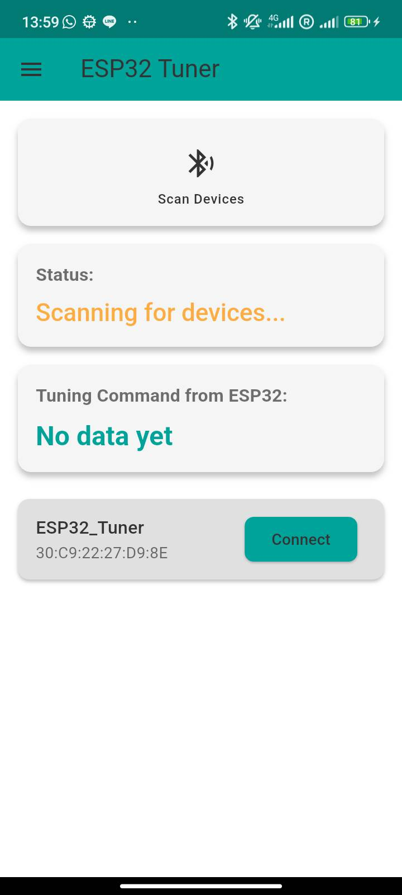

#### ESP32 Connected
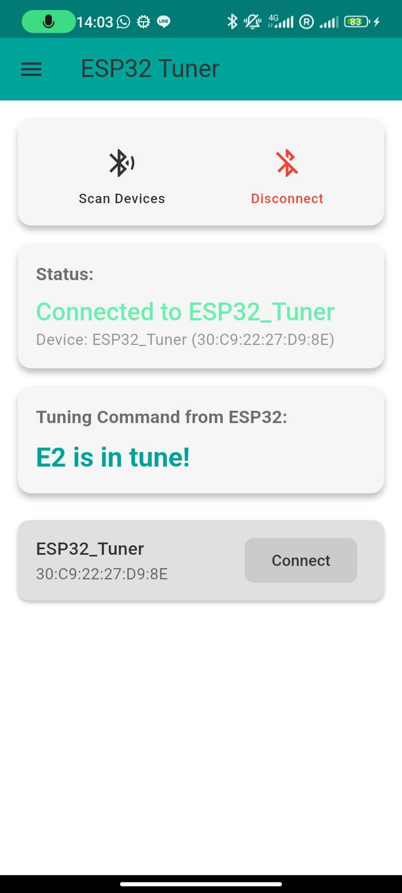

#### ESP32 Connection Status
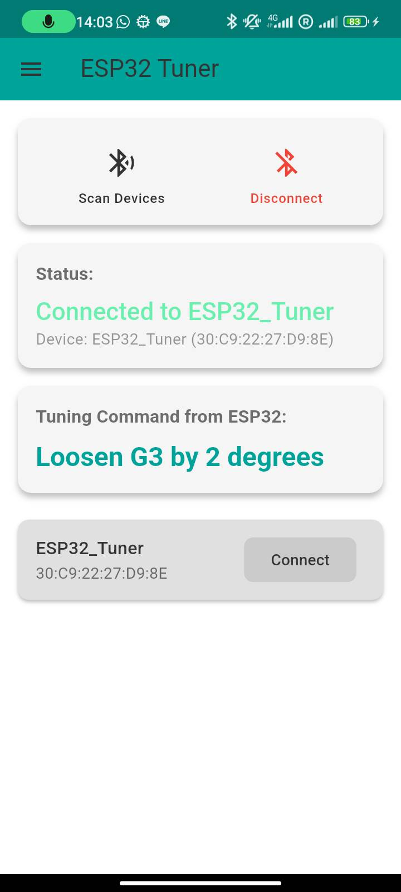

#### ESP32 Disconnected
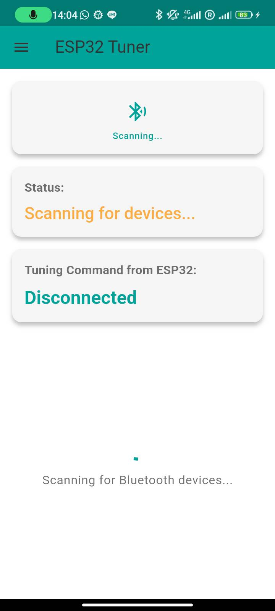

### Chord Detection & Analysis

#### Chord Detector Screen


#### Audio File Uploaded
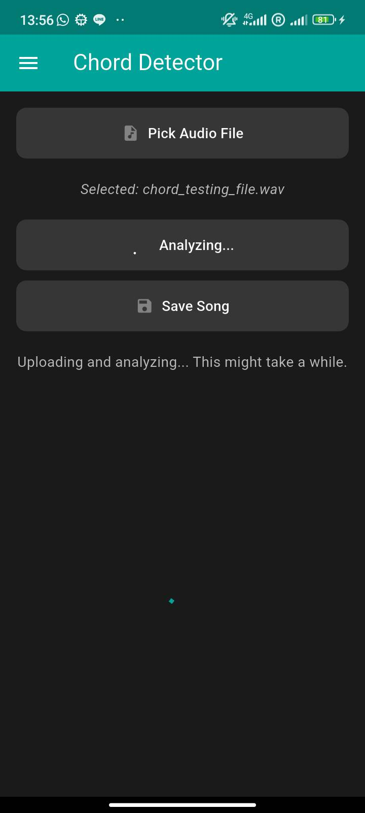

#### Chords Detected Results
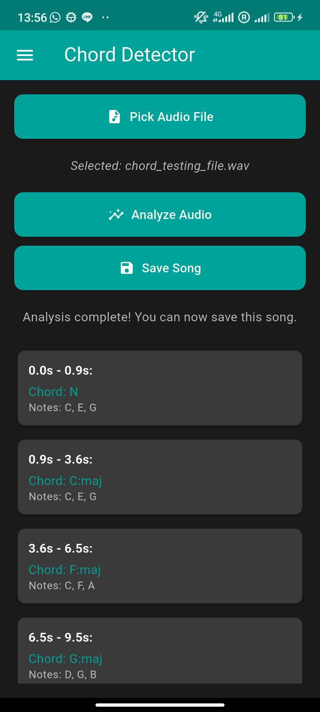

#### Song Successfully Saved
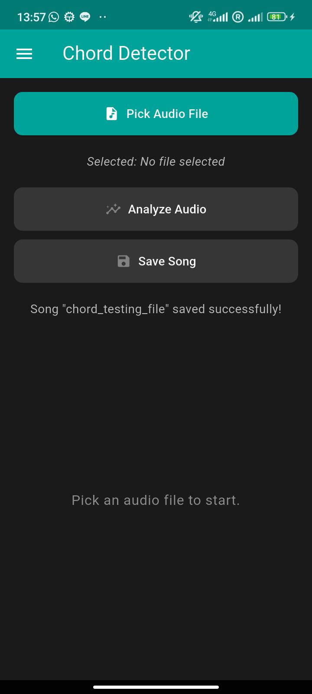

### Song Management & Playback

#### Saved Songs Library
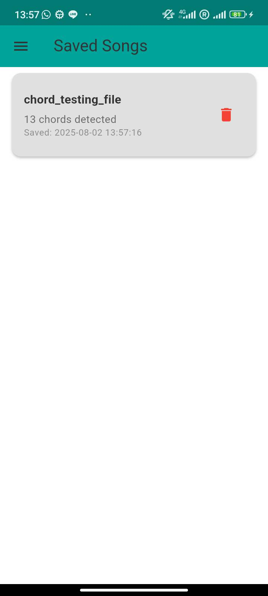

#### Song Playback with Chord Sync
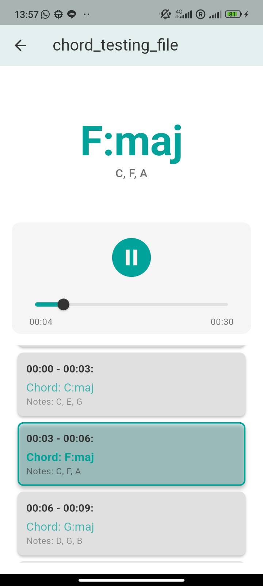

### Navigation & Backend

#### App Navigation Menu
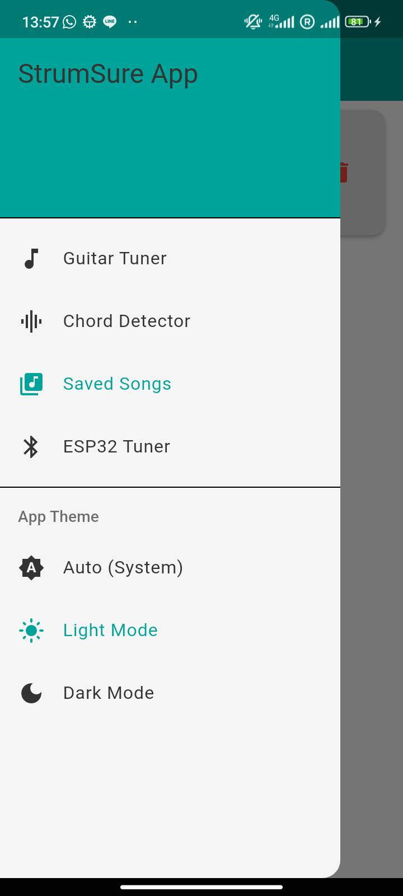

#### ESP32 Arduino Serial Monitor
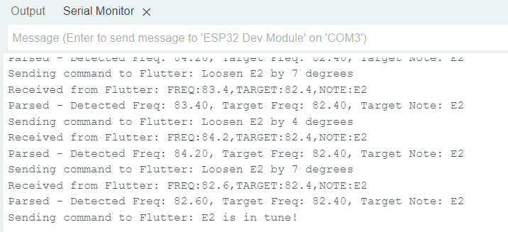

#### Google Colab Backend Results
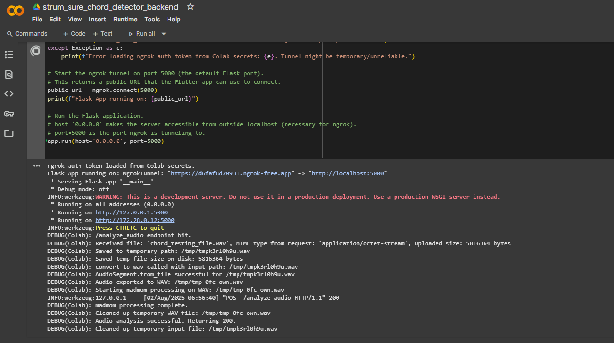

---

## Contributing

We welcome contributions to StrumSure! If you have suggestions, bug reports, or want to contribute code, please feel free to:

1. Fork the repository
2. Create a new branch (`git checkout -b feature/your-feature-name`)
3. Make your changes and commit them (`git commit -m 'Add new feature'`)
4. Push to your branch (`git push origin feature/your-feature-name`)
5. Open a Pull Request

---

## License

This project is licensed under the MIT License - see the [LICENSE](LICENSE) file for details.

---

## Contact

For any questions or feedback, please reach out to:

- **Name**: Eberechukwu Ajayi
- **Email**: ajayiisaiah777@gmail.com
- **GitHub**: https://github.com/ajayi-ei
